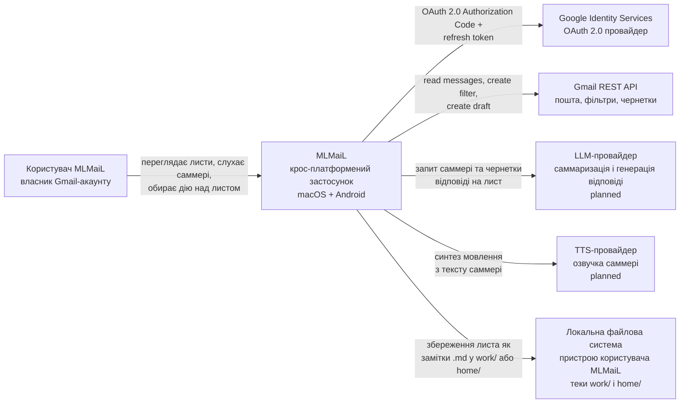

# C4 рівень 1 — System Context для MLMaiL

System Context застосунку MLMaiL описує, **хто** користується MLMaiL і з **якими
зовнішніми системами** MLMaiL спілкується. Це найвищий рівень C4-моделі MLMaiL:
без деталей про контейнери, мови чи фреймворки.

## Діаграма System Context для MLMaiL

## Користувач застосунку MLMaiL

Користувач застосунку MLMaiL — це **власник особистого або робочого
Gmail-акаунту**, який хоче розбирати вхідні листи у форматі «послухати → ухвалити
рішення», а не «прочитати → ухвалити рішення». Користувач застосунку MLMaiL
запускає MLMaiL на одному з двох пристроїв:

- macOS desktop (через Tauri-збірку для macOS);
- Android-телефон (через Tauri Android-збірку).

Користувач застосунку MLMaiL очікує від MLMaiL:

- авторизуватися один раз у свій Google-акаунт;
- бачити список вхідних листів Gmail;
- по черзі відкривати лист, слухати озвучене AI-саммері;
- одним рухом обрати дію: видалити, видалити та додати Gmail-фільтр на майбутнє,
  зберегти як `home/`-замітку, зберегти як `work/`-замітку;
- на завершення розгляду листа отримати запропоновану AI-чернетку відповіді
  для перегляду перед відправкою.

## Зовнішня система Google Identity Services

Google Identity Services — зовнішня система, що видає MLMaiL **OAuth 2.0 access
token і refresh token** для доступу до Gmail від імені користувача застосунку
MLMaiL. MLMaiL не зберігає пароль користувача; натомість MLMaiL зберігає
refresh token у локальному захищеному сховищі пристрою (keychain на macOS,
EncryptedSharedPreferences або еквівалент на Android).

Зв'язок MLMaiL → Google Identity Services:

- протокол: HTTPS;
- flow: OAuth 2.0 Authorization Code з PKCE (рекомендований для нативних
  застосунків);
- scopes: `https://www.googleapis.com/auth/gmail.modify` (потрібен для читання
  листів, створення фільтрів, створення чернеток).

## Зовнішня система Gmail REST API

Gmail REST API — зовнішня система Google, через яку MLMaiL читає і модифікує
пошту користувача застосунку MLMaiL. MLMaiL звертається до Gmail REST API з
access token, отриманим від Google Identity Services.

Зв'язок MLMaiL → Gmail REST API:

- протокол: HTTPS;
- ендпоінти (мінімальний набір цільової реалізації MLMaiL):
  - `users.messages.list` і `users.messages.get` — отримати вхідні листи;
  - `users.messages.trash` або `users.messages.delete` — видалення листа;
  - `users.settings.filters.create` — створити фільтр на майбутнє;
  - `users.drafts.create` — створити чернетку відповіді.

## Зовнішня система LLM-провайдер (planned)

LLM-провайдер — зовнішня система, до якої MLMaiL надсилає тіло листа і отримує:

- коротке текстове саммері листа (для відображення і озвучки у MLMaiL);
- запропоновану чернетку відповіді на лист (для останнього кроку розгляду листа
  у MLMaiL).

Конкретного провайдера для MLMaiL ще **не обрано** (статус: planned). Кандидати —
Anthropic Claude API, OpenAI Chat Completions, локальна модель через
зовнішній runtime. Вибір — у майбутньому ADR; до цього часу C4-модель MLMaiL
залишає LLM-провайдер як абстрактну зовнішню залежність.

## Зовнішня система TTS-провайдер (planned)

TTS-провайдер — зовнішня система, що приймає текст саммері від MLMaiL і
повертає аудіо-потік для відтворення на пристрої користувача застосунку MLMaiL.

Кандидати для MLMaiL — браузерний `SpeechSynthesis` API (нульова мережа,
доступний у WebView Tauri), хмарні TTS (Google Cloud TTS, ElevenLabs), локальна
модель. Вибір — у майбутньому ADR; до цього часу C4-модель MLMaiL залишає
TTS-провайдер як абстрактну зовнішню залежність.

## Зовнішня система Локальна файлова система

Локальна файлова система пристрою користувача застосунку MLMaiL — це **сховище
довгострокових заміток**, які MLMaiL створює, коли користувач застосунку MLMaiL
обирає дію `save → work` або `save → home`. Файли — звичайні Markdown-файли
(один файл на один лист), розкладені у дві теки:

- `work/` — листи, зафіксовані як робочі;
- `home/` — листи, зафіксовані як особисті.

MLMaiL читає і пише ці файли через Tauri-команди (Rust-сторона) — на десктопі це
звичайна тека у домашньому каталозі користувача застосунку MLMaiL, на Android —
sandbox-тека застосунку MLMaiL.

## Поточний стан System Context MLMaiL

На дату написання документації у репозиторії MLMaiL реалізовано:

- стартовий каркас Tauri 2 + Vue 3 (без UI листів);
- демо Tauri-команда `greet` у `app/src-tauri/src/lib.rs`.

Не реалізовано (planned): інтеграція з Google Identity Services, Gmail REST API,
LLM-провайдером, TTS-провайдером, читання/запис локальних `work/` і `home/`
заміток. Зовнішні системи у діаграмі вище — це **цільовий** System Context
MLMaiL, до якого реалізація має дотягнутися згідно з [README.md](../../README.md).

## Тести рівня System Context MLMaiL

Інтеграційні тести наскрізного сценарію MLMaiL (логін → вхідні → саммері → дія
→ чернетка) поки не написані. Це **прогалина**, яку слід заповнити паралельно з
реалізацією контейнерів MLMaiL (див. [02-containers.md](02-containers.md)).
