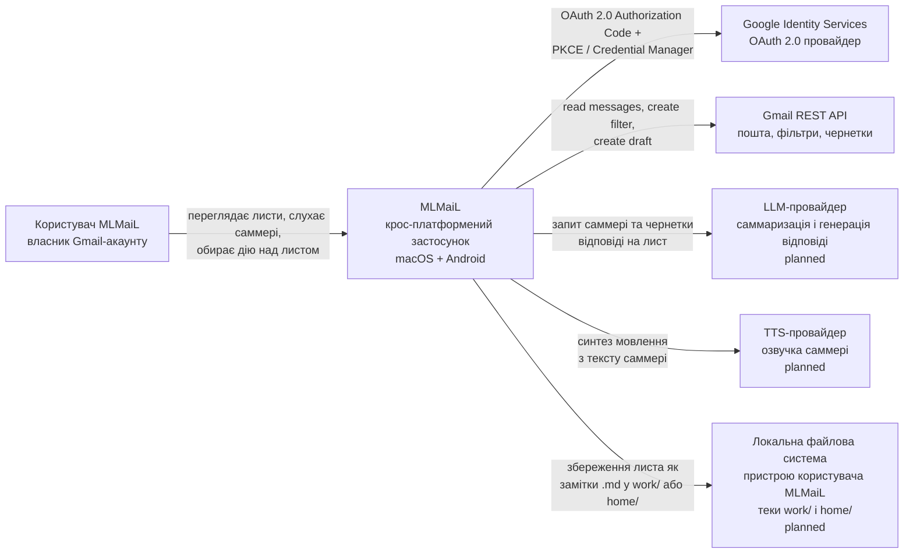

# C4 рівень 1 — System Context для MLMaiL

System Context застосунку MLMaiL описує, **хто** користується MLMaiL і з **якими зовнішніми системами** MLMaiL спілкується. Це найвищий рівень C4-моделі MLMaiL: без деталей про контейнери, мови чи фреймворки.

## Діаграма System Context для MLMaiL

## Призначення застосунку MLMaiL

MLMaiL — крос-платформений застосунок (macOS та Android), що допомагає власнику Gmail-акаунту опрацьовувати вхідні листи у форматі «послухати → ухвалити рішення». Замість читання кожного листа користувач MLMaiL слухає AI-саммері, а потім одним рухом обирає, що зробити з листом: видалити, зберегти в нотатки або підготувати відповідь.

MLMaiL вирішує проблему накопичення непрочитаних листів: часто лист потребує 5 секунд уваги, а не 3 хвилини читання. Застосунок MLMaiL скорочує час прийняття рішення про кожен лист і дозволяє опрацьовувати вхідні «на ходу» — навіть без клавіатури, тільки зі смартфоном або навушниками.

## Користувач застосунку MLMaiL

Користувач застосунку MLMaiL — це **власник особистого або робочого Gmail-акаунту**, який хоче розбирати вхідні листи у форматі «послухати → ухвалити рішення», а не «прочитати → ухвалити рішення». Користувач застосунку MLMaiL запускає MLMaiL на одному з двох пристроїв:

- macOS desktop (через Tauri-збірку для macOS);
- Android-телефон (через Tauri Android-збірку).

Застосунок MLMaiL не має веб-версії — Tauri не підтримує web як платформу розгортання; Vue-фронтенд застосунку MLMaiL деплоїться лише в межах Tauri WebView.

Користувач застосунку MLMaiL очікує від MLMaiL:

- авторизуватися один раз у свій Google-акаунт;
- бачити кількість листів у INBOX і переглядати вхідні листи;
- по черзі відкривати листи, переглядати тему, відправника і тіло листа;
- слухати озвучене AI-саммері кожного листа (planned);
- одним рухом обрати дію: видалити, видалити та додати Gmail-фільтр на майбутнє, зберегти як `home/`-замітку, зберегти як `work/`-замітку (planned);
- на завершення розгляду листа отримати запропоновану AI-чернетку відповіді для перегляду перед відправкою (planned).

## Зовнішня система Google Identity Services MLMaiL

Google Identity Services — зовнішня система, що видає MLMaiL **OAuth 2.0 access token і refresh token** для доступу до Gmail від імені користувача застосунку MLMaiL. MLMaiL не зберігає пароль користувача; натомість Rust-бекенд MLMaiL зберігає refresh token у захищеному файловому сховищі, access token — лише в пам'яті Rust-процесу.

Зв'язок MLMaiL → Google Identity Services:

- протокол: HTTPS;
- flow на macOS: OAuth 2.0 Authorization Code + PKCE через системний браузер + Rust loopback HTTP-server на `127.0.0.1:RANDOM_PORT`;
- flow на Android: Credential Manager (sign-in → ID token) + Google Identity AuthorizationClient (scope `gmail.modify` → server auth code) через Tauri 2 mobile plugin (Kotlin);
- scopes: `https://www.googleapis.com/auth/gmail.modify`;
- OAuth consent screen: Internal (лише акаунти `*@nitralabs.com`); перехід на External при масштабуванні за межі організації.

## Зовнішня система Gmail REST API MLMaiL

Gmail REST API — зовнішня система Google, через яку MLMaiL читає і модифікує пошту користувача застосунку MLMaiL. MLMaiL звертається до Gmail REST API виключно через Rust Tauri-команди з access token, отриманим від Google Identity Services; Vue Frontend застосунку MLMaiL не отримує access token і не звертається до Gmail REST API напряму.

Зв'язок MLMaiL → Gmail REST API:

- протокол: HTTPS;
- ендпоінти (реалізовані):
  - `users.labels.get?id=INBOX` — точна кількість листів у INBOX (`messagesTotal`);
  - `users.messages.list?labelIds=INBOX&maxResults=100&fields=messages/id` + `users.messages.get?id=<id>&format=full` — вибір і отримання тіла листа;
- ендпоінти (planned):
  - `users.messages.trash` або `users.messages.delete` — видалення листа;
  - `users.settings.filters.create` — створити фільтр на майбутнє;
  - `users.drafts.create` — створити чернетку відповіді.

## Зовнішня система LLM-провайдер MLMaiL (planned)

LLM-провайдер — зовнішня система, до якої MLMaiL надсилатиме тіло листа і отримуватиме коротке текстове саммері листа та запропоновану чернетку відповіді на лист. Конкретного провайдера для MLMaiL ще **не обрано** (статус: planned). Кандидати — Anthropic Claude API, OpenAI Chat Completions, локальна модель через зовнішній runtime. Вибір — у майбутньому ADR; до цього часу C4-модель MLMaiL залишає LLM-провайдер як абстрактну зовнішню залежність.

**TBD: tracing-storage.** Компонент MLMaiL, що виконуватиме LLM-виклики, потребуватиме трасування недетермінованих відповідей.

## Зовнішня система TTS-провайдер MLMaiL (planned)

TTS-провайдер — зовнішня система, що прийматиме текст саммері від MLMaiL і повертатиме аудіо-потік для відтворення на пристрої користувача застосунку MLMaiL. Кандидати для MLMaiL — браузерний `SpeechSynthesis` API (нульова мережа, доступний у WebView Tauri), хмарні TTS (Google Cloud TTS, ElevenLabs), локальна модель. Вибір — у майбутньому ADR; до цього часу C4-модель MLMaiL залишає TTS-провайдер як абстрактну зовнішню залежність.

**TBD: tracing-storage.** Компонент MLMaiL, що виконуватиме TTS-запити, потребуватиме трасування недетермінованих відповідей.

## Зовнішня система Локальна файлова система MLMaiL (planned)

Локальна файлова система пристрою користувача застосунку MLMaiL — це **сховище довгострокових заміток**, які MLMaiL створюватиме, коли користувач застосунку MLMaiL обиратиме дію `save → work` або `save → home`. Файли — звичайні Markdown-файли (один файл на один лист), розкладені у дві теки:

- `work/` — листи, зафіксовані як робочі;
- `home/` — листи, зафіксовані як особисті.

MLMaiL читатиме і записуватиме ці файли через Tauri-команди (Rust-сторона) — на desktop це звичайна тека у домашньому каталозі користувача застосунку MLMaiL, на Android — sandbox-тека застосунку MLMaiL. Функція в статусі planned.

## Use-cases застосунку MLMaiL

**Авторизація через Google.** Користувач MLMaiL відкриває застосунок і натискає «Увійти через Google». На macOS системний браузер відкриває сторінку авторизації Google; після успішного входу refresh token зберігається у файловому сховищі пристрою (`{app_data_dir}/session.json`, права `0600`, атомарний запис через POSIX rename). На Android Credential Manager показує native account picker. При повторному запуску застосунок MLMaiL відновлює сесію автоматично.

**Перегляд вхідних листів Gmail.** Після авторизації користувач MLMaiL бачить кількість листів у INBOX і може переглянути лист: тему, відправника, дату і тіло.

**AI-саммері листа (planned).** Користувач MLMaiL слухає коротке текстове саммері листа, сформоване LLM-провайдером MLMaiL.

**Озвучення саммері (planned).** TTS-провайдер MLMaiL синтезує мовлення з тексту саммері; користувач MLMaiL слухає аудіо на пристрої.

**Дія над листом (planned).** Користувач MLMaiL обирає одну з чотирьох дій: видалити лист; видалити і додати Gmail-фільтр, щоб подібні листи видалялися автоматично; зберегти як замітку у теку `home/`; зберегти як замітку у теку `work/`.

**Чернетка відповіді з пропозицією (planned).** Після перегляду листа MLMaiL пропонує користувачу AI-чернетку відповіді, сформовану LLM-провайдером MLMaiL, яку можна відредагувати і відправити через Gmail REST API MLMaiL.

## Cross-cutting concerns MLMaiL

**Приватність даних користувача MLMaiL.** Access token і refresh token ніколи не передаються у Vue Frontend — Rust-бекенд MLMaiL зберігає refresh token у захищеному файловому сховищі (`{app_data_dir}/session.json`, права `0600`, атомарний запис через POSIX rename на macOS; EncryptedSharedPreferences з master key у Android Keystore на Android), access token — лише в пам'яті Rust-процесу. Vue Auth Store застосунку MLMaiL зберігає лише `email`, `isAuthenticated`, `inboxCount` і `currentMessage` — жодних токенів у JS-пам'яті.

**Межі довіри MLMaiL.** Google Identity Services і Gmail REST API — зовнішні системи за межами довіри MLMaiL; зв'язок захищений HTTPS. Тіло листа передаватиметься до LLM-провайдера MLMaiL (planned); умови обробки даних визначатимуться при виборі конкретного провайдера.

**Мова інтерфейсу MLMaiL.** Весь видимий текст інтерфейсу застосунку MLMaiL — українською. Коди помилок Rust (`kind`) перекладаються у Vue Frontend через i18n-таблицю `auth-errors.js`.

## Поточний стан System Context MLMaiL

### Реалізовано

- Tauri 2 + Vue 3 + Quasar 2 застосунок для macOS і Android;
- OAuth 2.0 авторизація через Google Identity Services: Authorization Code + PKCE на macOS (loopback HTTP-server), Credential Manager на Android; реалізація: `app/src-tauri/src/auth/`;
- зберігання refresh token: на macOS — `FileStorage` (`{app_data_dir}/session.json`, права `0600`, атомарний запис через POSIX rename); на Android — EncryptedSharedPreferences з master key у Android Keystore; access token — лише в пам'яті Rust-процесу;
- читання OAuth Client IDs у runtime через `dotenvy` (`app/src-tauri/src/auth/config.rs`); `.env` — публічні Client IDs у приватному репозиторії, `.env.secret` — Desktop `client_secret` (gitignored);
- відображення кількості листів у INBOX через Tauri-команду `gmail_inbox_count` (`users.labels.get?id=INBOX`); реалізація: `app/src-tauri/src/gmail/mod.rs`;
- відображення випадкового листа з INBOX через Tauri-команду `gmail_random_message` (`users.messages.list` + `users.messages.get`), витяг plain-text тіла, truncate до 10 000 символів; реалізація: `app/src-tauri/src/gmail/message.rs`;
- Vue Auth Store (`app/src/services/auth-store.js`) — поля `email`, `isAuthenticated`, `inboxCount`, `currentMessage`; без токенів у JS-пам'яті;
- i18n-таблиця помилок авторизації і Gmail-помилок українською мовою (`app/src/i18n/auth-errors.js`);
- UI-фреймворк Quasar 2 з macOS material-look (`$primary: #0a84ff`, системний шрифт `-apple-system`).

### Planned

- AI-саммері листа (LLM-провайдер MLMaiL не обрано);
- озвучення саммері (TTS-провайдер MLMaiL не обрано);
- дії над листом: видалення, видалення з Gmail-фільтром, збереження у `work/`, збереження у `home/`;
- чернетка відповіді через LLM-провайдер MLMaiL;
- запис Markdown-заміток у локальну файлову систему.

## Тести рівня System Context MLMaiL

Інтеграційні тести Rust-команд MLMaiL (`auth_*`, `gmail_*`) реалізовані через Tauri Mock Runtime (`tauri::test::mock_builder`) у `app/src-tauri/tests/`; тести підмінюють реальний токен-стор і Google URLs через managed state (DI). Vue-тести реалізовані через `bun:test` (`app/src/services/auth-store.test.js`, `app/src/i18n/auth-errors.test.js`) та Vitest (`app/src/views/Login.vitest.js`).

Наскрізні e2e-тести сценарію MLMaiL (логін → вхідні → саммері → дія → чернетка) поки не написані. WebDriver e2e на macOS недоступний: Apple не публікує WebKit WebDriver для WKWebView у вбудованих застосунках; e2e через `webkit2gtk-driver` на Linux CI — у планах.
