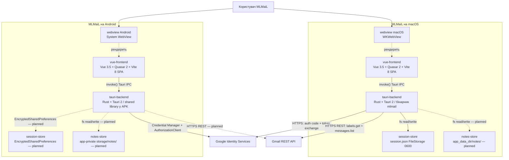

# C4 рівень 2 — Containers для MLMaiL

Container diagram застосунку MLMaiL описує **виконувані одиниці** і **сховища даних**, які разом утворюють MLMaiL, а також технологічний стек кожної одиниці. Зовнішні системи — Google Identity Services, Gmail REST API, LLM/TTS-провайдери — залишаються чорними скриньками на цьому рівні C4-моделі MLMaiL.

## Діаграма Containers для MLMaiL



## Контейнер `vue-frontend` MLMaiL

Контейнер `vue-frontend` MLMaiL — це single-page application MLMaiL, що рендериться у WebView: WKWebView на macOS, System WebView на Android. Контейнер `vue-frontend` MLMaiL тримає всю UI-логіку: Login-екран, відображення кількості листів INBOX, показ випадкового листа з поштової скриньки.

**Технологія:** Vue 3.5 (Composition API) + Quasar 2 + Vite 8. Маршрутизація — `vite-plugin-vue-layouts-next`. Auto-import composables — `unplugin-auto-import`. Vue macros — `vue-macros`. UI-компоненти — Quasar 2 з Material Symbols Outlined (префікс іконок `sym_o_` для `material-symbols-outlined`). Стиль — кастомні sass-vars у `app/src/quasar-variables.sass`: `$primary: #0a84ff` (macOS Accent Blue), system-ui font stack із SF Pro Text, `$button-border-radius: 6px`, `$generic-border-radius: 8px`. Dark mode — `config.dark: 'auto'` (слідує за OS).

**Відповідальність:** контейнер `vue-frontend` MLMaiL відображає стан авторизації та поштової скриньки, що надходить через Tauri IPC від контейнера `tauri-backend` MLMaiL. Контейнер `vue-frontend` MLMaiL **не** виконує HTTPS-запити до Google Identity Services чи Gmail REST API — усі мережеві виклики делегуються контейнеру `tauri-backend` MLMaiL через `invoke()`.

**Дані:** контейнер `vue-frontend` MLMaiL зберігає у реактивному стані `auth-store.js`:

- `isAuthenticated`, `email`, `isLoading`, `errorKind` — стан авторизаційної сесії;
- `inboxCount`, `inboxErrorKind` — кількість листів INBOX після успішного login;
- `currentMessage`, `messageErrorKind`, `isMessageLoading` — поточний випадковий лист.

Access token і refresh token у JS-пам'яті відсутні — вони зберігаються виключно у контейнері `tauri-backend` MLMaiL та контейнері `session-store` MLMaiL.

**Інтерфейси:**

- контейнер `vue-frontend` MLMaiL викликає Tauri IPC команди контейнера `tauri-backend` MLMaiL: `auth_start_login`, `auth_get_access_token`, `auth_is_authenticated`, `auth_current_email`, `auth_logout`, `gmail_inbox_count`, `gmail_random_message`;
- зв'язок з Google Identity Services і Gmail REST API проходить **через контейнер `tauri-backend` MLMaiL**; токени ніколи не передаються у JS-пам'ять.

**Розгортання:** статичний bundle у `app/dist/`, упакований Tauri всередину macOS `.app`-бінарника MLMaiL і Android APK MLMaiL. WebView завантажує файли через `tauri://`-схему без HTTP-сервера у продакшені.

## Контейнер `tauri-backend` MLMaiL

Контейнер `tauri-backend` MLMaiL — це нативний бінарник MLMaiL, побудований на Tauri 2 + Rust, який тримає WebView і обслуговує IPC-команди для контейнера `vue-frontend` MLMaiL. На macOS контейнер `tauri-backend` MLMaiL є окремим бінарником `mlmail`; на Android — shared library, упакованою у APK.

**Технологія:** Rust (edition 2021), Tauri 2 (`tauri = { version = "2" }`), плагін `tauri-plugin-opener`. Серіалізація — `serde`/`serde_json`. HTTP-клієнт — `reqwest` з `rustls`. Конфігурація — `dotenvy` (runtime-читання з `app/src-tauri/.env` та `app/src-tauri/.env.secret`; зміни підхоплюються наступним запуском без `cargo clean`). DI-механізм — Tauri managed state: `Arc<dyn RefreshTokenStorage>` під аліасом `SharedStorage` і структура `Endpoints { google_token, gmail_label_inbox, gmail_messages_list }` з `impl Default` (реальні Google URLs; підмінюються `mockito`-адресою у тестах).

**Відповідальність:** контейнер `tauri-backend` MLMaiL реалізує сім Tauri-команд.

_Auth-команди_ (`auth_start_login`, `auth_get_access_token`, `auth_is_authenticated`, `auth_current_email`, `auth_logout`):

- macOS: Authorization Code + PKCE через системний браузер + Rust loopback HTTP-server на `127.0.0.1:RANDOM_PORT`;
- Android: Credential Manager (sign-in → ID token) + Google Identity AuthorizationClient (scope `gmail.modify` → server auth code) через Tauri 2 mobile plugin (Kotlin `MlmailAuthPlugin`);
- обмін authorization code на access/refresh tokens — `oauth2.googleapis.com/token` (`app/src-tauri/src/auth/token_exchange.rs`);
- refresh-on-401: `AuthState.expiry: Option<Instant>` із 30-секундним freshness-буфером;
- зберігання refresh token — контейнер `session-store` MLMaiL через trait `RefreshTokenStorage`.

_Gmail-команди_ (`gmail_inbox_count`, `gmail_random_message`):

- `gmail_inbox_count`: `GET /gmail/v1/users/me/labels/INBOX` → поле `messagesTotal` (тип `u64`);
- `gmail_random_message`: `GET messages?labelIds=INBOX&maxResults=100` → випадковий ID → `GET messages/<id>?format=full` → plain-text тіло до 10 000 символів; пріоритет `text/plain` над `text/html`; `GmailError::Empty` для порожньої скриньки;
- обидві команди використовують helper `acquire_access_token` з авто-refresh.

_(planned)_ читання/запис `.md`-заміток у контейнері `notes-store` MLMaiL.

**Дані:** контейнер `tauri-backend` MLMaiL зберігає access token у пам'яті процесу (`AuthState`). Refresh token зберігається у контейнері `session-store` MLMaiL. Токени ніколи не передаються у JS-пам'ять контейнера `vue-frontend` MLMaiL.

**Інтерфейси:**

- контейнер `tauri-backend` MLMaiL приймає Tauri IPC від контейнера `vue-frontend` MLMaiL;
- контейнер `tauri-backend` MLMaiL виконує HTTPS до Google Identity Services (`oauth2.googleapis.com/token`) і Gmail REST API (`gmail.googleapis.com`);
- контейнер `tauri-backend` MLMaiL читає і пише контейнер `session-store` MLMaiL через trait `RefreshTokenStorage`.

**Розгортання:** macOS — бінарник `mlmail` у `.app`-бандлі; Android — shared library у APK. Конфігурація збірки — `app/src-tauri/tauri.conf.json` і `app/src-tauri/capabilities/default.json`.

TBD: tracing-storage — для команд `gmail_inbox_count` і `gmail_random_message`, що виконують HTTP-виклики до Gmail REST API.

**Тести:** `app/src-tauri/tests/auth_commands.rs`, `app/src-tauri/tests/auth_logout.rs`, `app/src-tauri/tests/auth_finalize_login.rs`, `app/src-tauri/tests/acquire_access_token.rs`, `app/src-tauri/tests/gmail_commands.rs` (5 integration-тестів через Tauri Mock Runtime).

## Контейнер `session-store` MLMaiL

Контейнер `session-store` MLMaiL — це **файл або платформне сховище**, де контейнер `tauri-backend` MLMaiL зберігає refresh token між перезапусками застосунку MLMaiL. Контейнер `session-store` MLMaiL відокремлений від сховища заміток MLMaiL (`notes-store`).

**Дані:** JSON-об'єкт `{ "refresh_token": "...", "email": "..." }`. На macOS — права доступу 0600 (тільки власник). Запис атомарний: temp-файл відкривається з `mode(0o600)` через `OpenOptions::mode`, потім POSIX `rename` замінює цільовий — усуває TOCTOU-вразливість схеми write→chmod. Файловий стор MLMaiL обраний замість macOS Keychain, щоб уникнути системного промпту «Дозволити доступ до Keychain?»: на macOS ad-hoc підпис бінарника змінюється між перебудовами і ACL «Завжди дозволяти» прив'язується до конкретного binary hash — файловий стор усуває цю залежність у dev і release.

**Розташування:**

| Платформа | Сховище                              | Шлях                                                              |
| --------- | ------------------------------------ | ----------------------------------------------------------------- |
| macOS     | FileStorage (JSON)                   | `~/Library/Application Support/com.vitaliytv.mlmail/session.json` |
| Android   | EncryptedSharedPreferences (planned) | app-private Keystore пакета `com.vitaliytv.mlmail`                |

**Інтерфейси:** контейнер `tauri-backend` MLMaiL читає і пише контейнер `session-store` MLMaiL через trait `RefreshTokenStorage` з аліасом `SharedStorage = Arc<dyn RefreshTokenStorage>`. Реалізація на macOS — `FileStorage` (`app/src-tauri/src/auth/storage/file.rs`). Реалізація на Android — `AndroidStorage` через Kotlin `SecureStore.kt` (planned).

**Розгортання:** файл `session.json` у `app_data_dir` Tauri на macOS. На Android — app-private Keystore (planned).

**Тести:** `app/src-tauri/src/auth/storage/file.rs` (7 unit-тестів у `#[cfg(test)]`).

## Контейнер `notes-store` MLMaiL

Контейнер `notes-store` MLMaiL — це **тека на диску пристрою**, де MLMaiL зберігатиме `.md`-замітки, створені діями `save → work` і `save → home` користувача застосунку MLMaiL. Контейнер `notes-store` MLMaiL не є базою даних: кожна замітка — окремий файл.

**Розташування:**

- macOS: `~/Library/Application Support/com.vitaliytv.mlmail/notes/`
- Android: app-private storage пакета `com.vitaliytv.mlmail/notes/`

**Структура (цільова):**

```text
notes/
├── work/
│   └── YYYYMMDD-HHMMSS-<gmail-message-id>.md
└── home/
    └── YYYYMMDD-HHMMSS-<gmail-message-id>.md
```

**Дані:** `.md`-файли заміток MLMaiL. Точну схему `.md`-замітки MLMaiL зафіксує майбутній ADR.

**Інтерфейси:** контейнер `tauri-backend` MLMaiL читатиме і писатиме контейнер `notes-store` MLMaiL через стандартні fs-API Tauri (planned).

**Розгортання:** тека `notes/` в `app_data_dir` Tauri. Тека відсутня до першої дії збереження.

**Тести:** TBD: tests.

## Контейнер `webview` MLMaiL

Контейнер `webview` MLMaiL — це **системний веб-рушій**, який Tauri 2 використовує для рендерингу контейнера `vue-frontend` MLMaiL без вбудованого Chromium. Контейнер `webview` MLMaiL не постачається у складі MLMaiL: на macOS — WKWebView, на Android — System WebView.

**Технологія:** WKWebView (macOS), System WebView (Android).

**Вплив на розробку:** версія System WebView на Android визначає сумісність CSS/JS контейнера `vue-frontend` MLMaiL, зокрема доступність `SpeechSynthesis` для майбутнього TTS-провайдера MLMaiL. e2e-тестування через WebDriver недоступне на macOS: Apple не надає WKWebView driver для вбудованих застосунків — macOS e2e покривається через Tauri Mock Runtime (`tauri::test::mock_builder`).

## Спільна конфігурація і секрети MLMaiL

Конфігурація контейнера `tauri-backend` MLMaiL зберігається у двох файлах:

| Файл                        | Статус у git                    | Вміст                                                                                                       |
| --------------------------- | ------------------------------- | ----------------------------------------------------------------------------------------------------------- |
| `app/src-tauri/.env`        | відстежується у приватному репо | `MLMAIL_GOOGLE_DESKTOP_CLIENT_ID`, `MLMAIL_GOOGLE_ANDROID_CLIENT_ID`, `MLMAIL_GOOGLE_ANDROID_WEB_CLIENT_ID` |
| `app/src-tauri/.env.secret` | `.gitignore`                    | `MLMAIL_GOOGLE_DESKTOP_CLIENT_SECRET`                                                                       |

Google OAuth Client IDs для нативних застосунків є публічними ідентифікаторами — вони передаються у мережевих запитах і тривіально витягуються з бінарника командою `strings`. Файл `app/src-tauri/.env` відстежується у приватному репозиторії `vitaliytv/mlmail`.

`dotenvy::dotenv().ok()` завантажує обидва файли першим кроком у `lib.rs::run()` до ініціалізації Tauri. Зміни у `.env` підхоплюються наступним запуском процесу без `cargo clean`.

**OAuth consent screen:** Internal тип (`orgInternalOnly: true`, лише для `@nitralabs.com`), що знімає вимогу Google App Verification для sensitive scope `gmail.modify` на ранньому етапі MLMaiL. Перехід на External + verification — явна майбутня дія при масштабуванні за межі організації `nitralabs.com`.

**Межі довіри:** контейнер `tauri-backend` MLMaiL — довірений контекст (нативний Rust-процес). Контейнер `vue-frontend` MLMaiL (WebView/JavaScript) — ненадійний: токени не передаються у JS-пам'ять. IPC-виклики від контейнера `vue-frontend` MLMaiL до контейнера `tauri-backend` MLMaiL обмежені capability `default` у `app/src-tauri/capabilities/default.json`.

## Розгортання MLMaiL

MLMaiL розгортається як два артефакти:

- macOS-додаток MLMaiL — `.app`/`.dmg`, збираються командою `bun run tauri build` всередині `app/`;
- Android-додаток MLMaiL — APK/AAB, збираються командою `bun run tauri android build`.

Конфігурація збірки MLMaiL — у `app/src-tauri/tauri.conf.json`: `identifier: com.vitaliytv.mlmail`, devUrl `http://localhost:1420`, beforeDevCommand `bun run dev`, beforeBuildCommand `bun run build`, frontendDist `../dist`.

Жодного серверного контейнера MLMaiL **не існує**: усі зовнішні залежності MLMaiL — Google Identity Services і Gmail REST API (реалізовано), LLM/TTS-провайдери (planned).

## Поточний стан MLMaiL

### Реалізовано

- **Контейнер `vue-frontend` MLMaiL** — Vue 3.5 + Quasar 2 з Login-екраном (`app/src/views/Login.vue`), Auth Store (`app/src/services/auth-store.js`) з полями `inboxCount` і `currentMessage`, i18n-таблицею помилок українською (`app/src/i18n/auth-errors.js`), Quasar sass-vars у `app/src/quasar-variables.sass`.
- **Контейнер `tauri-backend` MLMaiL** — Tauri 2 з повною Google OAuth-підсистемою (`app/src-tauri/src/auth/`), п'ятьма auth-командами `auth_*`, Gmail-модулем (`app/src-tauri/src/gmail/`) з командами `gmail_inbox_count` і `gmail_random_message`, DI через `Endpoints` (`app/src-tauri/src/endpoints.rs`) і `SharedStorage`, 32 Rust unit-тести + 5 integration-тестів через Tauri Mock Runtime (`app/src-tauri/tests/`).
- **Контейнер `session-store` MLMaiL (macOS)** — `FileStorage` (`app/src-tauri/src/auth/storage/file.rs`), `session.json` з правами 0600, атомарний запис через POSIX `rename`.
- Збірка артефактів MLMaiL під macOS і Android.

### Planned

- Контейнер `session-store` MLMaiL (Android) — `EncryptedSharedPreferences` через Kotlin `SecureStore.kt` (код наявний у `app/src-tauri/gen/android/`, не інтегрований з trait `RefreshTokenStorage`).
- Контейнер `notes-store` MLMaiL — теки `notes/work/`, `notes/home/` ще відсутні; ADR для схеми `.md`-файлу не написаний.
- Gmail-команди для Android-цілі контейнера `tauri-backend` MLMaiL.
- LLM/TTS-інтеграція — напрямок (Frontend чи Backend) визначить окремий ADR.
- Reply Drafter — чернетки відповіді на лист у контейнері `vue-frontend` MLMaiL.
- Router/layouts у контейнері `vue-frontend` MLMaiL — `App.vue` наразі показує лише `<Login/>`.

## Тести рівня Containers MLMaiL

Юніт-тести і integration-тести контейнера `tauri-backend` MLMaiL:

```sh
cd app/src-tauri && cargo test --lib auth   # 32 unit-тести auth-модуля
cd app/src-tauri && cargo test --test '*'   # 5 integration-тестів (Tauri Mock Runtime)
```

Тести контейнера `vue-frontend` MLMaiL — dual-runner стратегія: `bun:test` для pure-JS, Vitest для Vue SFC:

```sh
cd app && bun test src/services src/i18n   # pure-JS: auth-store, auth-errors
cd app && bunx vitest run                   # Vue SFC: Login.vitest.js
```

e2e-тести на рівні Containers MLMaiL ще не реалізовані. Цільові кандидати:

- macOS: Tauri Mock Runtime (`tauri::test::mock_builder()`) покриває команди без реального WebView — частково реалізовано у `app/src-tauri/tests/`;
- Linux CI: `tauri-driver` + WebDriverIO через `ubuntu-latest` + `xvfb-run` + `webkit2gtk-driver` (planned; macOS e2e через WebDriver не підтримується — Apple не надає WKWebView driver для вбудованих застосунків);
- Android: WebDriver/Appium проти `tauri android dev` (planned).
