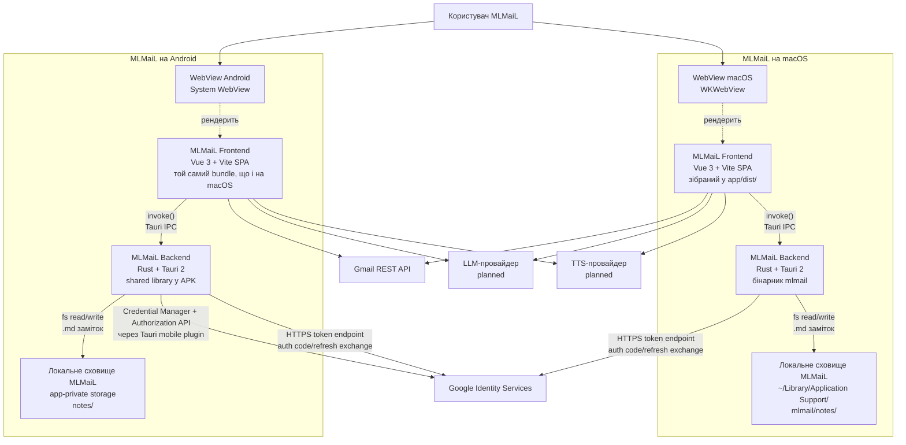

# C4 рівень 2 — Containers для MLMaiL

Container diagram застосунку MLMaiL описує **виконувані одиниці** і **сховища
даних**, які разом утворюють MLMaiL, а також технології, на яких побудована
кожна одиниця. На цьому рівні C4-моделі MLMaiL зовнішні системи з
[01-context.md](01-context.md) залишаються чорними скриньками — деталізації
заслуговують лише контейнери самого MLMaiL.

## Діаграма Containers для MLMaiL



## Контейнер MLMaiL Frontend

Контейнер MLMaiL Frontend — це single-page application MLMaiL на Vue 3, яка
рендериться у WebView (WKWebView на macOS, System WebView на Android). Цей
контейнер тримає всю UI-логіку MLMaiL: список листів, плеєр саммері, панель
дій, редактор чернеток.

Технології контейнера MLMaiL Frontend:

- мова: JavaScript (ESM);
- фреймворк: Vue 3 (composition API);
- збірка: Vite;
- маршрутизація і layouts: `vite-plugin-vue-layouts-next`;
- auto-import: `unplugin-auto-import` (імпорти `vue`, `vue-router`);
- макроси: `vue-macros`.

Артефакт збірки контейнера MLMaiL Frontend — статичний bundle у `app/dist/`,
який Tauri упаковує всередину десктопного бінарника MLMaiL і Android APK MLMaiL.
Контейнер MLMaiL Frontend сам по собі **не** обслуговується HTTP-сервером у
продакшені: WebView завантажує файли через `tauri://` схему.

Контейнер MLMaiL Frontend спілкується із:

- контейнером MLMaiL Backend — через Tauri IPC, виклики `invoke('<command>', …)`
  з `@tauri-apps/api/core` (зокрема `auth_*` команди для логіну і доступу до
  access token);
- зовнішніми Gmail REST API, LLM-провайдером і TTS-провайдером — HTTPS, прямо
  з WebView (planned для Gmail/LLM/TTS).

Зв'язок з Google Identity Services проходить **через контейнер MLMaiL Backend**:
обмін auth code → access/refresh tokens і всі refresh-виклики до
`https://oauth2.googleapis.com/token` робить Rust через `reqwest`/rustls;
токени ніколи не покидають Backend. Це закріплено ADR-0006 (див.
[decisions.md](decisions.md)).

## Контейнер MLMaiL Backend

Контейнер MLMaiL Backend — це нативний бінарник, побудований на Tauri 2 + Rust,
який тримає WebView і обслуговує IPC-команди для контейнера MLMaiL Frontend. На
macOS це окремий бінарник `mlmail`; на Android — shared library, упакована у
APK.

Технології контейнера MLMaiL Backend:

- мова: Rust (edition 2021);
- фреймворк: Tauri 2 (`tauri = { version = "2" }`);
- плагіни: `tauri-plugin-opener` (відкриття зовнішніх URL/файлів у системному
  застосунку);
- серіалізація: `serde`, `serde_json`.

Контейнер MLMaiL Backend оголошує Tauri-команди і відповідає за такі обов'язки:

- **Google OAuth-авторизація** (`auth_start_login`, `auth_get_access_token`,
  `auth_is_authenticated`, `auth_current_email`, `auth_logout`): запуск
  loopback-OAuth flow на macOS, виклик Credential Manager + AuthorizationClient
  на Android, обмін auth code на access/refresh tokens, refresh-on-401,
  зберігання refresh token у Keychain/EncryptedSharedPreferences. Деталі —
  ADR-0006 і [03-components.md](03-components.md).
- (planned) читання/запис `.md`-заміток у локальному сховищі MLMaiL;
- (planned) можливо, проксі HTTPS-запитів до LLM/TTS-провайдерів — рішення
  відкладено до окремого ADR.

Конфігурація контейнера MLMaiL Backend живе у `app/src-tauri/tauri.conf.json` і
`app/src-tauri/capabilities/default.json`. Capability `default` дає головному
вікну MLMaiL дозволи `core:default` і `opener:default`; будь-які нові Tauri-API
вимагатимуть оновлення цього файлу.

## Контейнер Локальне сховище MLMaiL

Контейнер Локальне сховище MLMaiL — це **тека на диску пристрою**, де MLMaiL
зберігає `.md`-замітки, створені діями `save → work` і `save → home`
користувача застосунку MLMaiL. Це не база даних: кожен лист — окремий файл.

Розташування контейнера Локальне сховище MLMaiL:

- macOS: всередині `app data dir` Tauri (`~/Library/Application Support/com.vitaliytv.mlmail/`);
- Android: app-private storage пакета `com.vitaliytv.mlmail`.

Структура контейнера Локальне сховище MLMaiL (цільова):

```text
notes/
├── work/
│   └── YYYYMMDD-HHMMSS-<gmail-message-id>.md
└── home/
    └── YYYYMMDD-HHMMSS-<gmail-message-id>.md
```

Точну схему `.md`-замітки MLMaiL зафіксує майбутній ADR.

## Контейнер WebView (macOS і Android)

Контейнер WebView — це **системний веб-рушій**, який Tauri використовує для
рендерингу контейнера MLMaiL Frontend. MLMaiL не постачає власний рушій:
використовується WKWebView на macOS і System WebView на Android. Це впливає на
сумісність CSS/JS у контейнері MLMaiL Frontend і має враховуватися при виборі
TTS-API (наприклад, доступність `SpeechSynthesis` залежить від версії System
WebView на Android).

## Розгортання MLMaiL

MLMaiL розгортається як два артефакти:

- macOS-додаток MLMaiL — `.app`/`.dmg`, збираються командою
  `bun run tauri build` усередині `app/`;
- Android-додаток MLMaiL — APK/AAB, збираються командою
  `bun run android` (для dev) і `bun run tauri android build` (для релізу).

Конфігурація збірки MLMaiL — у `app/src-tauri/tauri.conf.json`:
`identifier: com.vitaliytv.mlmail`, devUrl `http://localhost:1420`,
beforeDevCommand `bun run dev`, beforeBuildCommand `bun run build`,
frontendDist `../dist`.

Жодного серверного контейнера MLMaiL **не існує**: усі зовнішні залежності
MLMaiL — це Google Identity Services, Gmail REST API і майбутні LLM/TTS
провайдери.

## Поточний стан контейнерів MLMaiL

Реалізовано:

- контейнер MLMaiL Frontend — Vue 3 з Login-екраном
  ([app/src/views/Login.vue](../../app/src/views/Login.vue)), Auth Store
  ([app/src/services/auth-store.js](../../app/src/services/auth-store.js)) і
  i18n-таблицею помилок українською
  ([app/src/i18n/auth-errors.js](../../app/src/i18n/auth-errors.js));
- контейнер MLMaiL Backend — Tauri 2 з повною Google OAuth-підсистемою
  ([app/src-tauri/src/auth/](../../app/src-tauri/src/auth/)), п'ятьма Tauri-командами
  `auth_*` і 32 Rust unit-тестами;
- збірка обох контейнерів MLMaiL під macOS і Android (підтверджено
  історією комітів `android` і конфігурацією `tauri.conf.json`).

Не реалізовано (planned):

- контейнер Локальне сховище MLMaiL — тек `notes/work/`, `notes/home/` ще немає;
- Gmail-інтеграція (Gmail Client, Inbox List, Mail Reader);
- LLM/TTS-інтеграція (Summary Service, Speech Service);
- Reply Drafter (чернетки відповіді на лист);
- router/layouts у MLMaiL Frontend — App.vue показує лише `<Login/>`.

## Тести рівня Containers MLMaiL

Контейнерні і e2e-тести MLMaiL поки не реалізовані. Цільові кандидати:

- e2e-тести MLMaiL у режимі desktop — через `tauri-driver` або Playwright проти
  локально запущеного `bun run dev`;
- e2e-тести MLMaiL під Android — через WebDriver/Appium проти `tauri android dev`;
- юніт-тести Tauri-команд MLMaiL — `cargo test` всередині `app/src-tauri/`.

Це **прогалина**, яку слід заповнити паралельно з реалізацією контейнерів MLMaiL.
