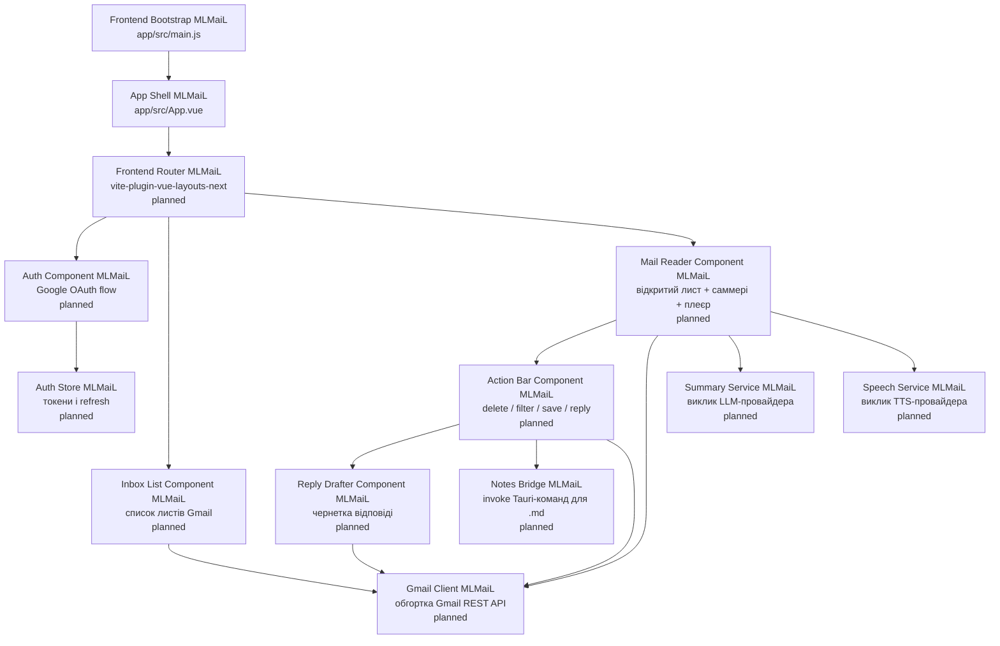
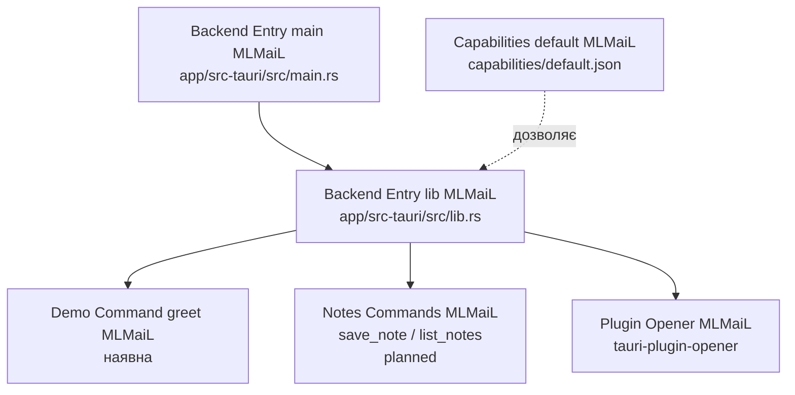

# C4 рівень 3 — Components для MLMaiL

Component diagram MLMaiL розкриває **внутрішню структуру кожного контейнера**
з [02-containers.md](02-containers.md). На цьому рівні описуємо логічні модулі
контейнера MLMaiL Frontend (Vue 3) і контейнера MLMaiL Backend (Rust + Tauri).

Розділи нижче самодостатні: кожен компонент MLMaiL прив'язаний до файлів коду
і до зовнішніх систем з [01-context.md](01-context.md).

## Компоненти контейнера MLMaiL Frontend



### Компонент Frontend Bootstrap MLMaiL

Frontend Bootstrap MLMaiL — точка входу контейнера MLMaiL Frontend, файл
[app/src/main.js](../../app/src/main.js). Він монтує кореневий Vue-застосунок у
DOM-елемент `#app` з [app/index.html](../../app/index.html). Завдяки
`unplugin-auto-import` глобальна функція `createApp` доступна без явного імпорту.

Зараз файл містить мінімум:

```js
import App from './App.vue'

createApp(App).mount('#app')
```

У цільовій реалізації MLMaiL Frontend Bootstrap MLMaiL також підключає
маршрутизатор (vue-router) і реєструє auto-imported layouts.

### Компонент App Shell MLMaiL

App Shell MLMaiL — кореневий Vue-компонент, файл [app/src/App.vue](../../app/src/App.vue).
У стартовому шаблоні MLMaiL це демо-сторінка з логотипами Tauri/Vue/Vite і
формою `greet`, що викликає Tauri-команду `greet` (див.
[04-code.md](04-code.md)).

У цільовій реалізації MLMaiL App Shell MLMaiL стає тонкою обгорткою
`<router-view>` + `<layout>`, делегуючи всю поведінку дочірнім компонентам:
Auth Component MLMaiL, Inbox List Component MLMaiL, Mail Reader Component MLMaiL.

### Компонент Auth Component MLMaiL (planned)

Auth Component MLMaiL відповідає за OAuth 2.0 flow з Google Identity Services
для MLMaiL: запускає Authorization Code flow з PKCE, отримує access і refresh
токени, передає їх в Auth Store MLMaiL. На macOS Auth Component MLMaiL може
звертатися до контейнера MLMaiL Backend через `tauri-plugin-opener`, щоб
відкрити системний браузер; на Android — Custom Tab.

Залежить від:

- зовнішнього Google Identity Services (HTTPS);
- Auth Store MLMaiL (зберігання токенів).

### Компонент Auth Store MLMaiL (planned)

Auth Store MLMaiL — реактивне сховище токенів MLMaiL (composable або pinia-store)
у контейнері MLMaiL Frontend. Зберігає access token у пам'яті процесу MLMaiL і
кешує refresh token у захищеному сховищі через IPC-міст до контейнера MLMaiL
Backend (на macOS — keychain через майбутній Tauri-плагін, на Android —
EncryptedSharedPreferences).

Auth Store MLMaiL відповідає також за **оновлення access token** через refresh
token, коли Gmail REST API повертає `401`.

### Компонент Gmail Client MLMaiL (planned)

Gmail Client MLMaiL — обгортка над Gmail REST API для MLMaiL. Інкапсулює
HTTPS-виклики, додавання заголовку `Authorization: Bearer <token>` з Auth Store
MLMaiL, retry при `401` через Auth Store MLMaiL.

Поверхня Gmail Client MLMaiL відповідає мінімальному набору сценаріїв MLMaiL:

- `listInbox(maxResults)` — отримати останні листи з вхідних;
- `getMessage(id)` — отримати тіло конкретного листа;
- `trashMessage(id)` — видалити лист (помістити в кошик);
- `createFilter(criteria, action)` — створити Gmail-фільтр для дії
  `delete + filter`;
- `createDraft(message)` — створити чернетку відповіді.

### Компонент Inbox List Component MLMaiL (planned)

Inbox List Component MLMaiL — Vue-компонент списку вхідних листів MLMaiL.
Використовує Gmail Client MLMaiL, щоб отримати список, рендерить рядок на лист,
обробляє вибір листа і переходить на маршрут Mail Reader Component MLMaiL.

### Компонент Mail Reader Component MLMaiL (planned)

Mail Reader Component MLMaiL — Vue-компонент перегляду одного листа Gmail у
MLMaiL. Відповідає за оркестрацію наступних кроків сценарію MLMaiL:

1. отримати тіло листа через Gmail Client MLMaiL;
2. запитати саммері у Summary Service MLMaiL;
3. передати саммері у Speech Service MLMaiL і відтворити аудіо;
4. показати Action Bar Component MLMaiL з чотирма діями;
5. при виборі `reply` — показати Reply Drafter Component MLMaiL.

### Компонент Summary Service MLMaiL (planned)

Summary Service MLMaiL — клієнт LLM-провайдера у контейнері MLMaiL Frontend.
Приймає тіло листа (текст + метадані) і повертає коротке саммері.

Конкретний LLM-провайдер для MLMaiL обере ADR (див. [decisions.md](decisions.md)).
До того часу Summary Service MLMaiL описаний як абстракція: одна функція
`summarize(messageBody): Promise<string>`.

### Компонент Speech Service MLMaiL (planned)

Speech Service MLMaiL — клієнт TTS-провайдера у контейнері MLMaiL Frontend.
Приймає текст саммері і відтворює аудіо в межах WebView.

Базовий кандидат для MLMaiL — браузерний `SpeechSynthesis` API (працює без
мережі і без ключів). Перевірка доступності на Android System WebView —
завдання майбутньої реалізації MLMaiL.

### Компонент Action Bar Component MLMaiL (planned)

Action Bar Component MLMaiL — Vue-компонент з чотирма діями над поточним листом
у MLMaiL:

- `delete` — Gmail Client MLMaiL `trashMessage(id)`;
- `delete + filter` — Gmail Client MLMaiL `trashMessage(id)` плюс
  `createFilter(…)` для відправника/теми;
- `save → home` — Notes Bridge MLMaiL пише `.md` у `notes/home/`;
- `save → work` — Notes Bridge MLMaiL пише `.md` у `notes/work/`;
- після будь-якої з дій — перехід до Reply Drafter Component MLMaiL для
  останнього кроку (підготовка чернетки відповіді).

### Компонент Reply Drafter Component MLMaiL (planned)

Reply Drafter Component MLMaiL — Vue-компонент, що показує запропоновану AI
чернетку відповіді на лист і дає користувачу MLMaiL відредагувати її перед
відправкою. Сама відправка — через Gmail Client MLMaiL `createDraft(message)`
(прямі відправлення без перегляду навмисно не передбачені у MLMaiL — користувач
завжди контролює фінальний крок).

### Компонент Notes Bridge MLMaiL (planned)

Notes Bridge MLMaiL — тонка обгортка над IPC у MLMaiL: викликає Tauri-команди
контейнера MLMaiL Backend для запису і читання `.md`-заміток у контейнері
Локальне сховище MLMaiL.

Поверхня Notes Bridge MLMaiL:

- `saveNote(kind: 'work' | 'home', message): Promise<void>`;
- `listNotes(kind: 'work' | 'home'): Promise<Note[]>` (для майбутнього перегляду).

Реалізація `invoke('save_note', …)` чекає на відповідні Tauri-команди у
контейнері MLMaiL Backend (див. нижче).

## Компоненти контейнера MLMaiL Backend



### Компонент Backend Entry main MLMaiL

Backend Entry main MLMaiL — файл [app/src-tauri/src/main.rs](../../app/src-tauri/src/main.rs).
Це **тонкий** `main.rs`: на не-debug збірках MLMaiL вимикає консольне вікно
Windows атрибутом `#![cfg_attr(not(debug_assertions), windows_subsystem = "windows")]`
і викликає `mlmail_lib::run()`. Уся логіка контейнера MLMaiL Backend живе у
crate-бібліотеці `mlmail_lib` (див. `[lib]` секцію [app/src-tauri/Cargo.toml](../../app/src-tauri/Cargo.toml)).

### Компонент Backend Entry lib MLMaiL

Backend Entry lib MLMaiL — функція `run()` у файлі
[app/src-tauri/src/lib.rs](../../app/src-tauri/src/lib.rs). Вона будує
`tauri::Builder` для MLMaiL, реєструє плагіни і Tauri-команди:

```rust
tauri::Builder::default()
    .plugin(tauri_plugin_opener::init())
    .invoke_handler(tauri::generate_handler![greet])
    .run(tauri::generate_context!())
    .expect("error while running tauri application");
```

Атрибут `#[cfg_attr(mobile, tauri::mobile_entry_point)]` робить ту саму
функцію точкою входу для Android-збірки MLMaiL.

### Компонент Demo Command greet MLMaiL

Demo Command greet MLMaiL — наявна стартова команда у
[app/src-tauri/src/lib.rs](../../app/src-tauri/src/lib.rs):

```rust
#[tauri::command]
fn greet(name: &str) -> String {
    format!("Hello, {}! You've been greeted from Rust!", name)
}
```

Команда `greet` MLMaiL використовується лише на демо-формі у App Shell MLMaiL і
буде **видалена** при першій бойовій ітерації Notes Commands MLMaiL.

### Компонент Notes Commands MLMaiL (planned)

Notes Commands MLMaiL — набір Tauri-команд для роботи з контейнером Локальне
сховище MLMaiL:

- `save_note(kind: NoteKind, message: GmailMessage) -> Result<NotePath, AppError>`;
- `list_notes(kind: NoteKind) -> Result<Vec<NoteSummary>, AppError>`;
- (можливо) `delete_note(path: NotePath) -> Result<(), AppError>`.

Команди Notes Commands MLMaiL використовують Tauri `app_data_dir()` як корінь
для теки `notes/`, нормалізують ім'я файлу за шаблоном
`YYYYMMDD-HHMMSS-<gmail-message-id>.md` і записують Markdown-замітку MLMaiL з
frontmatter (від кого, дата, тема). Точну схему фіксуватиме ADR.

### Компонент Plugin Opener MLMaiL

Plugin Opener MLMaiL — `tauri-plugin-opener`, ініціалізований у Backend Entry
lib MLMaiL. На клієнтській стороні MLMaiL надає API для відкриття URL/файлів у
системному застосунку — використовується, зокрема, для відкриття системного
браузера у OAuth flow MLMaiL (див. Auth Component MLMaiL).

### Компонент Capabilities default MLMaiL

Capabilities default MLMaiL — файл
[app/src-tauri/capabilities/default.json](../../app/src-tauri/capabilities/default.json).
Описує дозволи для головного вікна MLMaiL:

```json
{
  "$schema": "../gen/schemas/desktop-schema.json",
  "identifier": "default",
  "description": "Capability for the main window",
  "windows": ["main"],
  "permissions": ["core:default", "opener:default"]
}
```

Будь-який новий Tauri-API у MLMaiL (наприклад, `fs:allow-write-text-file` для
записів `.md`) має бути доданий саме сюди — без цього інакше IPC-виклики MLMaiL
будуть відхилені рантаймом Tauri.

## Тести рівня Components MLMaiL

Юніт- і компонентних тестів MLMaiL поки немає. Цільові мінімальні тести
компонентів MLMaiL:

- Vue-компоненти MLMaiL — Vitest + `@vue/test-utils` (mount + поведінка);
- Tauri-команди MLMaiL — `cargo test` для чистої Rust-логіки і
  `tauri::test::mock_runtime` для команд з handle;
- Notes Bridge MLMaiL — тест на круг `saveNote → list_notes` проти
  тимчасової теки `app_data_dir()`.

Це **прогалина**, яку слід заповнити одночасно з реалізацією відповідних
компонентів MLMaiL.
